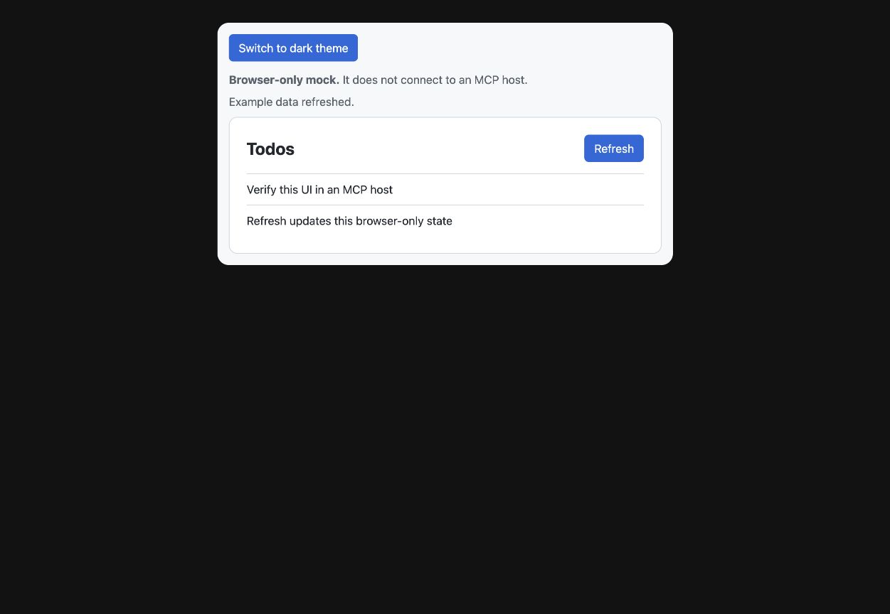

# MCP Apps

MCP Apps are optional UIs linked to MCP-enabled tools. The project owns the UI; the library builds and registers it.

```text
Project React entry → self-contained HTML → content-hashed ui:// resource
                                                   ↓
                                          MCP tool metadata
                                                   ↓
                                           Host iframe + bridge
```

Create `platforms/ui/todos.html` with a root element and a module script pointing to `todos.tsx`. Add `ui: 'todos'` to the selected function, then regenerate. Multiple functions may reuse one UI entry.

UI build tooling is optional. Install Vite, its React plugin, and `vite-plugin-singlefile` in the consuming app. For Tailwind v4 styles, also install `tailwindcss` and `@tailwindcss/vite`; the bundler loads that optional plugin when available. The generator reports missing build dependencies. React and React DOM are optional package peers. It uses an isolated build configuration, without loading the application's Vite or PostCSS configuration.

See the [React todo example](../examples/mcp-app/README.md) for the host bridge, structured results, native pagination, and a clearly labeled browser mock.



The example also supports narrow layouts and host themes. [Mobile dark-theme capture](assets/mcp-app-mobile-dark.jpg). These captures verify the browser mock, which is labeled in the UI; actual host interaction is a separate check.

Import presentational components from your web app when useful. The Vite 8 bundler resolves the application's TypeScript path aliases, including imports such as `@/components/todos`. Keep Convex web hooks and the MCP host bridge in separate wrappers. The MCP wrapper receives tool results and calls existing tools through the host; it does not embed bearer tokens or connect directly to Convex.

The package React entry wraps the official MCP Apps bridge. Apply host theme/style context, show loading/errors, disable unsupported actions and refresh data through tools. Realtime subscriptions are not automatically created by attaching a UI.

Configure only required CSP origins. Bundling does not load `.env` files or copy `public/` assets into the widget. A static HTML resource must contain no user data or secrets; authenticated tool results provide current data at runtime.

The generator checks the UI entry and standalone output. Visually verify every supported host's rendering and interactions. Hosts may expose different capabilities. See the [official MCP Apps documentation](https://modelcontextprotocol.io/extensions/apps/overview).
